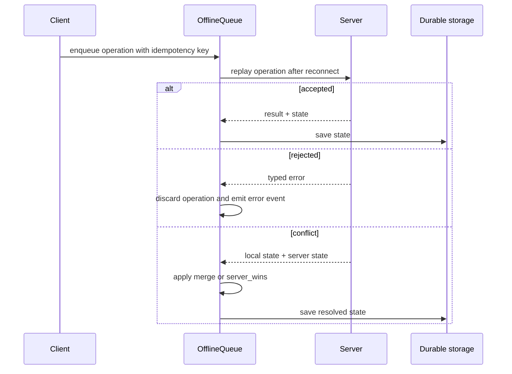

# Synchronization and reward transactions

Version 0.13.0 makes reward persistence atomic. A `ServerPersistenceAdapter` must
implement `executeClaimRewardTransaction`; there is no non-transactional fallback.
The adapter commits stock, user state, claim count, audit log, and idempotency data
as one unit and rolls all of them back if any write fails.

## Adapter example

```ts
async executeClaimRewardTransaction(params, mutation) {
  return database.transaction(async (transaction) => {
    const current = await readClaimContext(transaction, params);
    if (current.stock !== null && current.stock <= 0)
      return { success: false, error: "OUT_OF_STOCK" };
    const next = mutation(current);
    if (next.error !== undefined) {
      await writeAudit(transaction, next.auditLog);
      await writeIdempotency(transaction, params.idempotencyKey, next.result);
      return { success: false, error: next.error };
    }
    await writeStock(transaction, params, next.nextStock);
    await writeUserState(transaction, params, next.nextUserState);
    await writeClaimCountAndRecord(transaction, params, next.nextUserState);
    await writeAudit(transaction, next.auditLog);
    await writeIdempotency(transaction, params.idempotencyKey, next.result);
    return { success: true };
  });
}
```

The exact transaction primitive is storage-specific: PostgreSQL should use a
database transaction and row locks, while Redis should use a Lua script or an
equivalent atomic workflow. Do not implement the method as a sequence of
independent network writes.

## Offline conflict policy

`OfflineQueue` supports `server_wins` and `merge`. Merge keeps the server state as
the base, adds locally acquired stamps that are absent on the server, preserves
server reward values, and gives a consumed reward priority if either side consumed it.



Each replay response is classified as `ACCEPTED`, `REJECTED_PERMANENT`, or
`RETRYABLE_ERROR`. Accepted and permanent responses are removed after the response
is durably handled; permanent reasons are emitted as client error events.
Transport or explicitly retryable failures remain queued for `retrySync`.
`useStampRally` observes the client state and error events, so accepted and merged
results are visible immediately.

The default queue key is `stamprally:queue:<rallyId>:<userId-or-anonymous>`. A
queue can switch users with `switchUser(userId)`; every operation is checked against
the active rally/user scope. Pass an explicit `key` only when an application owns
an equivalent isolation scheme.

## Custom adapter checklist

Implement `OfflineQueueStorage.load` and `save` as durable operations, preserving
the order of the array. A sync sender should return the operation result wrapped as
`{ status: "ACCEPTED", result }`, return `{ status: "REJECTED_PERMANENT", error }`
for a condition that cannot succeed later, and use `{ status: "RETRYABLE_ERROR",
error }` for a temporary failure. Never include proof secrets in rejection metadata.

For reward claims, `packages/server/src/examples/transaction.ts` contains a SQL
adapter contract. Read stock, claim count, and user state with row locks, then write
stock, state, claim record, audit, and idempotency data through one transaction.

## Metadata security boundary

`publicMetadata` is safe to include in `toPublicConfig` and may be sent to browsers.
`serverMetadata` is never published and can contain internal IDs, moderation notes,
or integration details. Treat all client-provided proof data and public metadata as
untrusted input; validate it on the server and do not copy secrets into audit metadata.
