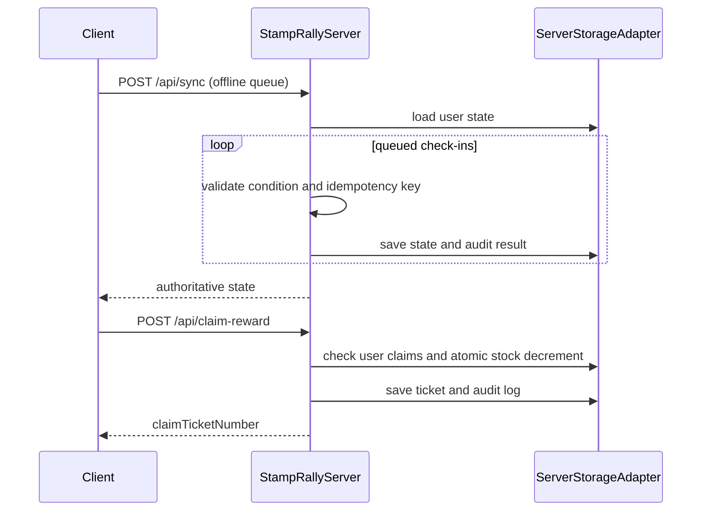

# Server synchronization and reward claims

The server is authoritative when a device reconnects. The client submits its
offline check-in queue with idempotency keys; the server validates each proof
against the private rally configuration, ignores duplicate keys, and returns
the latest user state.

Reward claims are serialized per server instance and must be backed by an
atomic adapter operation across instances. A failed stock decrement never
produces a successful claim or success audit record.

Recovery tokens use HMAC-SHA256 signatures and optionally AES-GCM encryption.
They should have an expiry (`exp`) for operational recovery workflows.
